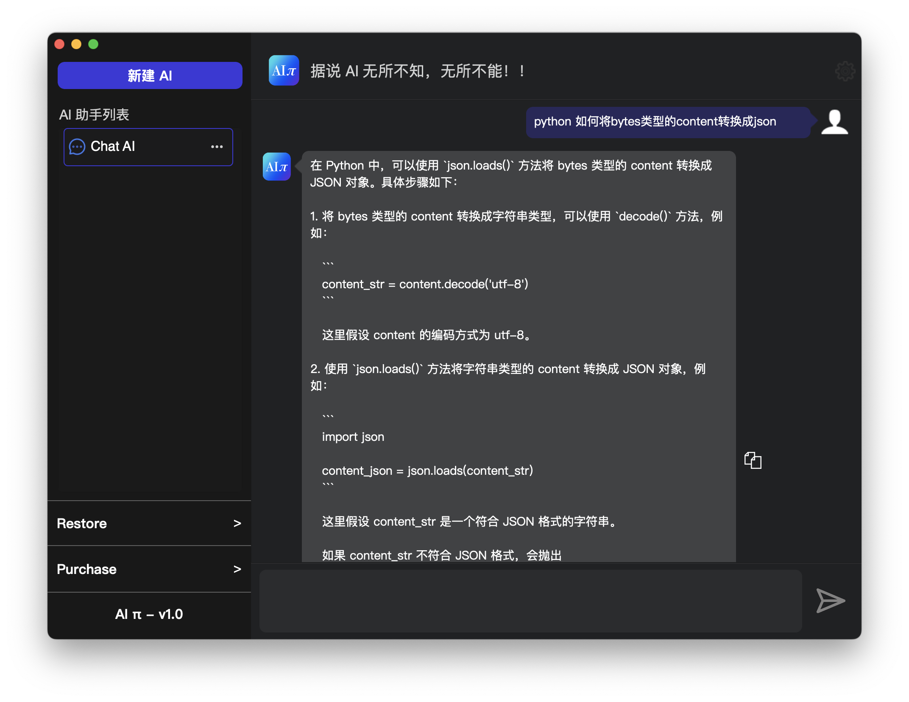

###[首页](http://innovatorzhu.github.io/index.html)&#160;&#160;&#160;&#160;&#160;		[产品](http://innovatorzhu.github.io/products.html) &#160;&#160;&#160;&#160;&#160;[关于我们](http://innovatorzhu.github.io/about.html)

<table style="margin-left: 1; margin-right: 1; ">
	<tr>
		<td width=60%>
			
		</td>
		<td width=40%>
			<text style="font-size: 22px;">全能型 AI 助理 </text>
			

			<li style="font-size: 18px;">智能聊天助理 </li>
			<li style="font-size: 18px;">声音助理(开发中...) </li>
			<li style="font-size: 18px;">图像助理(开发中...) </li>
		</td>
	</tr>
</table>
<table>
	<tr>
		<td width=50% height=400px;>
			<text style="font-size: 22px;">Apple 平台应用开发助手 </text>
			

			<li style="font-size: 18px;">支持为 Apple 平台（iOS、WatchOS、Mac）app，快速生成各种尺寸图标</li>
			<li style="font-size: 18px;">图标支持快速缩进，加圆角，不熟悉 PS 的您照样出彩 </li>
			<li style="font-size: 18px;">支持 PNG、JPEG、TIFF、PSD 等多种图片格式 </li>
		</td>
		<td width=40%>
			
		</td>
	</tr>
</table>

<table style="margin-left: 1; margin-right: 1; ">
	<tr>
		<td width=20%>
			<a href="http://innovatorzhu.github.io/Privacy Policy.html">Privacy Policy</a>
		</td>
		<td width=20%>
			<a href="http://innovatorzhu.github.io/Terms OF Use.html">Terms Of Use</a>
		</td>
		<td width=80%>
		</td>
	</tr>
</table>
<html>